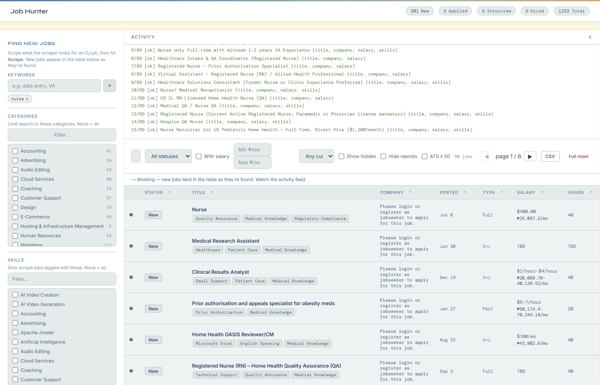
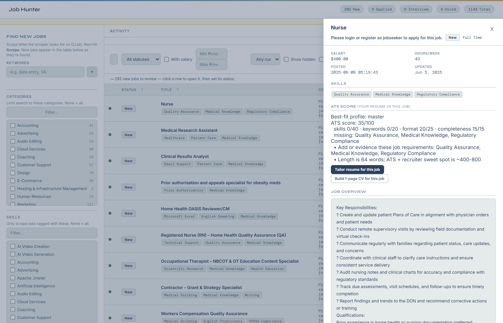
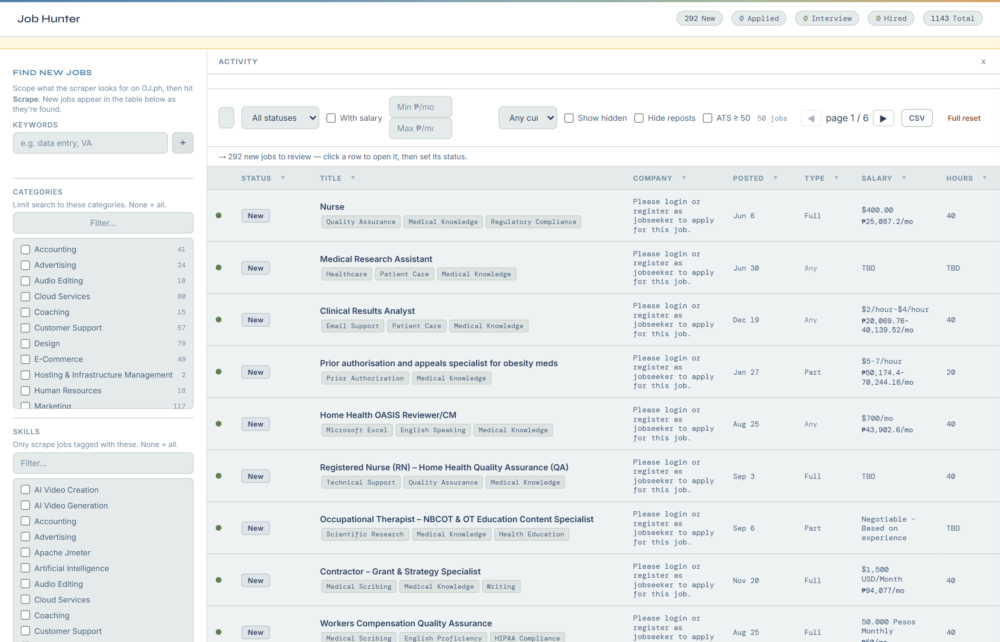

# Job Hunter Dashboard

Local job-tracking dashboard for [OnlineJobs.ph](https://www.onlinejobs.ph).
FastAPI + SQLite backend, vanilla-JS frontend, server-sent-events live console.

## Demo

Live scrape in progress — new jobs land in the table as they're found, streamed over SSE:



Job detail modal: ATS score against your resume, missing skills, and one-click resume tailoring / 1-page CV build:



The dashboard: keyword/category/skill scoping, column funnels, currency-normalized salaries (live FX rates), server-side pagination:



## Setup

```bash
pip install -r requirements.txt
python main.py                # starts on http://127.0.0.1:8371
```

Optional flags: `--port 8080`, `--host 0.0.0.0`, `--skip-skills`.
First run auto-fetches the site's skill taxonomy into `jobs.db` (skippable with `--skip-skills`).

**Windows, no Python yet?** Double-click `install.bat` once (it makes a venv and installs
the dependencies), then `run.bat` to start.

**Fresh clone, first run:** open **http://127.0.0.1:8371**, expand **Resume → Edit your
resume** and fill in your name, email, phone and skills. Hit **Scrape jobs** (or wait for
the auto-run) to fill the table. Everything you add stays on this machine — your data and
resume are local, only the code is in this repo.

Configuration lives in `config.json`, overlaid by the gitignored
`config.local.json` (secrets, personal paths). Every key:

| Key (config.json) | Meaning |
|---|---|
| `base_url` / `api_url` | Site + skills API origin |
| `db_path` | SQLite file (relative → resolved against the project dir) |
| `request_delay` | Global throttle between outbound requests (seconds) |
| `max_retries` | Retries on 429/5xx (exponential backoff; also respects server `Retry-After` headers) |
| `user_agent` | User-Agent sent with every outbound request |
| `enrich_workers` | Parallel detail-page workers |
| `enrich_interval_days` | "Check for updates" re-checks jobs older than this |
| `backup_retention_days` | How many backups `scripts/backup.py` keeps (default 7 if omitted) |
| `fx_to_php` (`.usd`) | FX rate used to normalize foreign-currency salaries to PHP (US$800/mo at 58 → ₱46,400). Override in `config.local.json` when the market moves; the rate actually used is recorded in the DB with a timestamp and shown with the normalized value |
| `llm_base_url` / `llm_api_key` / `llm_model` | *(local overlay only)* any OpenAI-compatible endpoint for tailor + CV build |
| `resume_sources` | *(local overlay only)* folders/files of resume PDFs/DOCX/TXTs the 1-page CV builder digests; defaults to `resumes/` |
| `oj_cookies` | *(local overlay only)* session cookies passed to the site when provided; redacted in `/api/config` |

## Workflow

1. **Scrape jobs** — enter a keyword (e.g. `bookkeeper`) and/or pick categories & skills,
   then click **Scrape jobs**. The console streams live: harvest stubs land in the table
   as they're found, then the enrich phase reports progress `[n/N]` and a summary
   (`▸ Enrich: X open, Y closed, Z err`).
2. **Filter the table** — search box, column funnels (each header has a ▼ filter),
   the "With salary" toggle, and header-click sorting. The *Date posted* column sorts
   chronologically / reverse-chronologically and filters by a **From/To date range**.
3. **Keyword auto-hide** — maintain positive (keep) and negative (hide) keyword chips,
   then **Apply**. Positive keywords are an aggressive rule for `New` jobs: every job
   that doesn't contain at least one positive keyword is hidden, and every job that
   does is restored — matched on whatever text exists yet (title, company, skills,
   description once enriched), so fresh harvests are filtered immediately.
   Keywords match **whole words** (case-insensitive, simple plurals included):
   `AI` matches "AI", "AI-powered" — never "email" or "chain"; `video` catches
   "Video Editors" but not "videography". Manually set statuses are never
   clobbered by the filter.
4. **Track** — click any row for the detail modal: change status
   (New → Interested → Applied → …), notes, follow-up date, and view history.
   The green/red/gray dot shows the site-side state (Open / Closed / unknown).
5. **Check for updates** — re-fetches detail pages for jobs whose check is stale
   (or never checked). Deleted listings (HTTP 404/410, "no longer available" wording)
   are marked **Closed**. **Stop** aborts a run mid-flight; the console says how
   far it got.

**Tips**

- Keep keywords narrow — every page/detail page is a real request to the site,
  throttled to 1/second.
- Hidden jobs stay in the DB for dedup — they won't resurface in future scrapes.
- **CSV export** — toolbar button downloads a full server-side CSV dump of all
  jobs (no pagination, streams via `/api/jobs/export`). The client-side JS
  fallback still works for quick one-off exports.

## Auto-run & alerts

The **Auto-run** panel (sidebar) keeps the tracker fresh on its own:

- **Auto-run enabled** + interval (1–24 h, default 4 h) — a daemon thread in the
  server harvests the whole board and re-checks new/stale jobs on schedule.
  Manual *Scrape*/*Check* and auto-run never run at once (shared lock).
- **Enable desktop alerts** — one click for Notification permission; you then get
  a desktop notification for every new-job batch, job closure, salary change, and
  follow-up that's due, delivered over the SSE stream (`/api/events`).

The app can start at Windows logon: double-click `scripts/make_autostart.bat`
to create the `JobHunter` scheduled task (`pythonw main.py`);
`scripts/disable_autostart.bat` disables it again.

**Backups** — `scripts/backup.py` takes a `VACUUM INTO` snapshot of `jobs.db`
into `backups/` and prunes to the newest N (N = `backup_retention_days`,
default 7). Run it on a schedule (on the owner's machine: a daily 03:00 task)
or by hand: `python scripts/backup.py`. Restore = copy a snapshot back over
`jobs.db` (see `docs/operations.md`).

## Data quality

- **Reposts** — same title re-posted by the same employer gets a `↻ repost`
  badge (points at the original). *Hide reposts* toolbar toggle filters them.
- **Salary** — free-text salary is parsed into monthly min/max and shown as a
  `₱…/mo` / `US$…/mo` chip (hourly×160, weekly×4.33, daily×30, annual÷12).
- **Parse watchdog** — if the search page stops yielding job boxes while the
  site claims results, the run logs a `structure change` alert instead of
  silently recording zero.

## Scrape curation, auto-applied filters, full reset
- **Auto-run scope** — the scrape panel's keywords/categories/skills can be
  saved as the auto-run scope (`POST /api/scrape-scope`). The auto-run then
  harvests only that scope; empty scope = scrape everything (default).
- **Keyword rules persist + auto-apply** — `Apply auto-hide` saves your
  positive/negative lists server-side. Every auto-run re-applies them to fresh
  jobs automatically (desktop alert when it hides any). Inputs hydrate from
  the saved rules on page load — a refresh no longer wipes your filters.
- **Full reset** — toolbar button: deletes every job + status history in one
  shot. Keeps saved keyword rules, scrape scope, scheduler settings, resume
  masters, and backups.

## Resume tailoring + ATS

- **Master resumes** (`resumes/masters.json`) — multiple named track profiles
  in one file: `clinical-data-automation` (default), `healthcare`, `tech-data`.
  A fresh clone's `masters.json` is seeded from the checked-in
  `resumes/master.json` starter template (itself derived from the real
  Dropbox masters). Add/rename any via
  `PUT /api/resume {"profile": name, "master": …}`.
- **ATS score** — deterministic, not LLM (recruiter-side first passes are
  keyword + structure based, and a rule scorer can't hallucinate):
  `GET /api/resume/ats?job_id=N[&auto=1]` → 0-100 = skills 40 + keywords 20 +
  format 25 + completeness 15, with matched/missing skills and rule-based
  suggestions. `auto=1` scores every profile and returns the best fit —
  the job drawer uses this, so the right track always gets your resume.
- **ATS filter** — toolbar toggle “ATS ≥ 50” hides every job your best-fitting
  profile scores below 50 on (`GET /api/jobs?min_ats=50`). Collapses the full
  list down to the jobs actually worth your time.
- **Tailor** — `POST /api/resume/tailor {"job_id": N, "auto": 1}`: the LLM
  rewrites the best-fitting profile for that job — rewrite & reorder only,
  never invents facts, written in the owner's tone (short, no buzzwords);
  invalid or failed output falls back to the profile. Returns tailored resume + score.
- **Export** — `GET /api/resume/export?job_id=N&tailored=1&fmt=docx|txt[&auto=1]`:
  one column, standard headings, real bullets — the layout ATS parsers chew
  best. PDF skipped (docx is what ATS want).
- **1-page CV (Harvard)** — `POST /api/resume/build {"job_id": N, "auto": 1}`:
  digests every file in `resume_sources` (PDF/DOCX/TXT/MD/JSON, e.g. your
  Dropbox resumes folder), the LLM drafts a RenderCV Harvard-template YAML
  from those facts only, renders it, and **iterates until it is exactly one
  page** (max 4 rounds; it never ships a two-pager). Output PDF + YAML land
  in `resumes/built/` and list in the panel's *Built CVs*. Optional: needs
  Python 3.12+ (`install.bat` makes a separate `.venv-rendercv`; the button
  hides itself when the toolchain is missing).
- **LLM config** — `config.local.json` (gitignored overlay of `config.json`,
  any OpenAI-compatible endpoint): `llm_base_url` / `llm_api_key` /
  `llm_model`. Copy `config.local.json.example` to `config.local.json` and point it at
  your endpoint (a local vLLM box, OpenAI, etc.). Without it, tailor and CV
  build return 503; the ATS scorer works regardless.
- **Resume sources** — `resume_sources: ["C:\\Users\\YOU\\Dropbox\\Resumes"]`
  in `config.local.json`: folders or files of your resume PDFs/DOCX/TXTs that
  the 1-page CV builder digests. Defaults to the project's `resumes/` folder.

## HTTP API & SSE

| Endpoint | What it does |
|---|---|
| `POST /api/pipeline/run` `{"keyword": …, "categories": …, "skills": …, "posted_since": …}` | Scrape; streams the run as SSE (`run_started`, `job`/`page`/`error`/`log`, `done`) |
| `POST /api/pipeline/check` (optional `{"workers": …}`) | Re-check stale detail pages; same SSE stream |
| `POST /api/pipeline/stop` `{"run_id": …}` | Stop that run (omitting `run_id` stops the active run) |
| `GET /api/events` | Long-lived SSE alert stream: new-job batches, closures, salary changes, due follow-ups, structure changes, auto-run hidden-by-keywords |
| `GET /api/schedule` / `POST /api/schedule` | Auto-run on/off + interval (1–24 h) + last run/status |
| `GET /api/config` / `POST /api/config/reload` | Live config (secrets redacted) + reload without restart (W1.4) |
| `GET /api/jobs`, `GET /api/jobs/export` | Query (search, status, salary, `min_ats`, date range) + full CSV |
| resume endpoints | `PUT/GET /api/resume`, `GET /api/resume/ats`, `POST /api/resume/tailor`, `GET /api/resume/export`, `POST /api/resume/build` — see the Resume section above |
| `GET /health` | Real health probe (see the Health check section below) |

Full architecture: `docs/architecture.md`.

**Error contract (W5.2):** every non-2xx JSON response is `{"error": {"code", "message", "detail"}}` — e.g. `not_found`, `bad_request`, `validation_error` (message names the field, `detail` lists `{loc,msg,type}`), `conflict` / `stopped` (user-initiated stop is a conflict, not a crash), `db_locked` (503), `bad_value` (400). Success bodies are never enveloped.

## Health check

`GET /health` probes the database (short busy timeout) and the site (5 s
timeout), both in worker threads:

- `200 {"status": "ok", "db": "ok", "site": "ok", "pid": ...}`
- `200 {"status": "degraded", "db": "locked", ...}` — the DB is locked;
  the app still serves cached data
- `503 {"status": "degraded", "site": "unreachable", ...}` — the site is
  down, so scraping can't run

Useful for monitoring, service managers, or Windows Task Manager restart
scripts (a 503 means the restart script should act).

## Shutdown (Ctrl-C)

The first **Ctrl-C** sends a stop signal to the in-flight pipeline run (if
any), then uvicorn stops accepting connections and waits for the run's stream
to end — **at most 10 seconds**, after which it forces the shutdown. A
**second Ctrl-C** during shutdown exits immediately.

The process ends with a summary line — where the last run landed, e.g.
`Last run: 2026-02-24 10:00:00 (stopped - partial results kept in jobs.db)`
— and every database handle is closed. Stopped runs are recorded as `stopped`
(partial results kept), never `failed`; only a raised error is `failed`.

## Logging

Log files rotate at 5 MB each (3 backups) and land in `job_hunter.log*`. A copy
of INFO+ messages streams to stderr when running interactively.

## Files

| Path | Purpose |
|---|---|
| `main.py` | Entry point (DB init, skills refresh, uvicorn, graceful Ctrl-C shutdown) |
| `config.json` / `config.local.json.example` | Runtime configuration / template for the local overlay |
| `app/server.py` | FastAPI app: REST + SSE endpoints |
| `app/schemas.py` / `app/sse.py` | Pydantic models / SSE helpers (hardened streams) |
| `app/config.py` | Live config: merged read, `reload()`, redaction (W1.4) |
| `app/deps.py` | Per-thread DB connection registry, closed on shutdown (W2.1) |
| `app/scheduler.py` | Auto-run daemon thread: per-run stop tokens, run registry, status recording (W2.5/W2.8) |
| `db/connection.py` | Schema, `get_conn()`/`init_db()`, config/DB-path accessors for scripts |
| `db/migrate.py` | Versioned migration registry (`user_version`-gated steps) + `python -m db.migrate --dry-run` (W2.7) |
| `db/repos/jobs.py` | Job CRUD + query + status history |
| `db/repos/skills.py` | Skill taxonomy store |
| `scraper/client.py` | HTTP client: throttle, backoff, per-run stop token, `Retry-After` handling |
| `scraper/salary.py` | Free-text salary → monthly (min, max, currency); hourly ×160, weekly ×4.33, daily ×30, annual ÷12 |
| `scraper/parsers.py` | HTML → structured data (search list, detail, closed detection) |
| `scraper/pipeline.py` | `harvest()` / `enrich()` event generators |
| `scraper/skills.py` | Skills API client |
| `resumes/{schema,ats,tailor,render}.py` | Multi-profile master JSON, deterministic ATS scorer, LLM tailor, docx/txt render |
| `resumes/{digest,yamlcv}.py` | Source digest + RenderCV Harvard-template one-page CV builder |
| `resumes/master.json` | Starter template (edit in the UI) — a fresh clone starts from this |
| `resumes/masters.json` | Your named track profiles (gitignored, local-only) — created by editing the resume in the UI |
| `scripts/backup.py` | `VACUUM INTO` backup + retention pruning (run on a schedule or by hand) |
| `scripts/make_autostart.bat` / `disable_autostart.bat` | Create/disable the Windows `JobHunter` logon task |
| `tools/gate.sh` | One-command gate: ruff + full pytest + personal-path check + README truth check |
| `tools/check_readme.py` | README truthfulness check (every config key documented; no stale counts) (W1.6) |
| `install.bat` / `run.bat` | Windows double-click setup + start (creates a venv) |
| `static/index.html` / `static/app.js` / `static/style.css` | Dashboard UI |
| `docs/` | Architecture, operations (backup/restore/autostart), scraping politeness & ToS |
| `tests/` | pytest suite (DB, parsers, pipeline, API) |

## Development

```bash
pip install -r requirements-dev.txt   # pytest + ruff (test/lint gate)
sh tools/gate.sh                     # the full gate run before every push
python -m pytest tests/ -q           # full suite, no network
python -m db.migrate --dry-run       # show which migration steps a DB would run
JOBS_DB_PATH=/tmp/sandbox.db python main.py --port 8372   # run against a DB copy
```

`JOBS_DB_PATH` (absolute, or relative to the project dir) overrides `db_path` —
used to test against a copy of a real database.

## License

Copyright (c) 2025–2026 Jeyson Anki. **All rights reserved.** This repository is
private; no open-source license is granted, and the absence of a `LICENSE`
file is deliberate. Do not copy code from here without permission.
